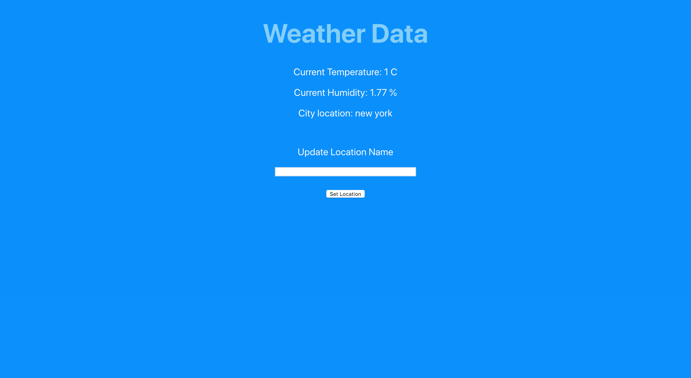

## Weatherly UI

A simple web UI built with React JS and OpenWeather API that 
lets you get the current forecast of a city through a search bar.

The main purpose of this project was to learn Automation test framework like Jest and Enzyme. 

This project has E2E tests, integration tests and unit tests. 

## ScreenShot
 